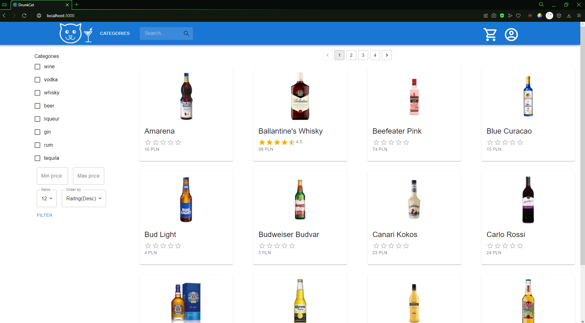
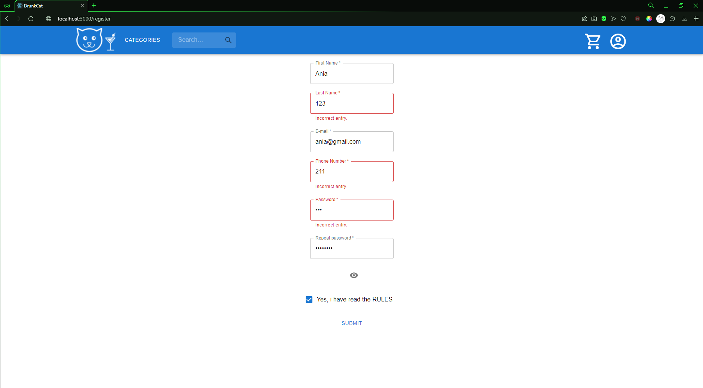
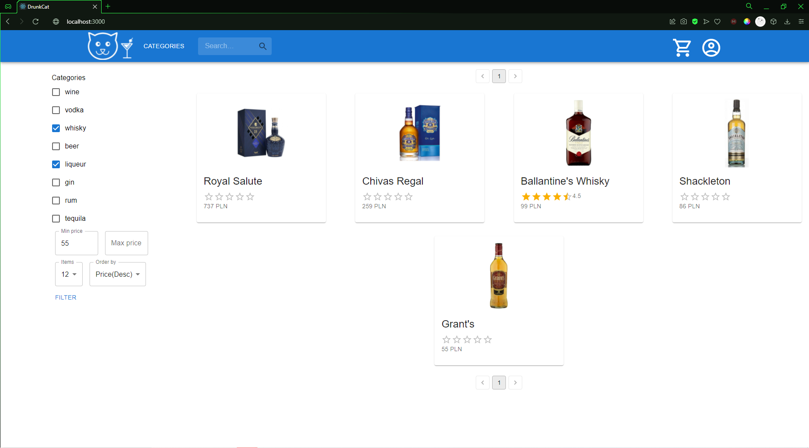
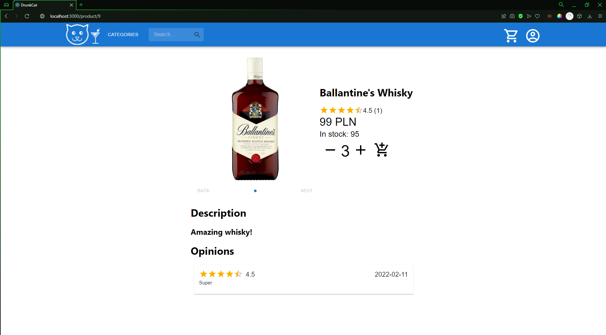
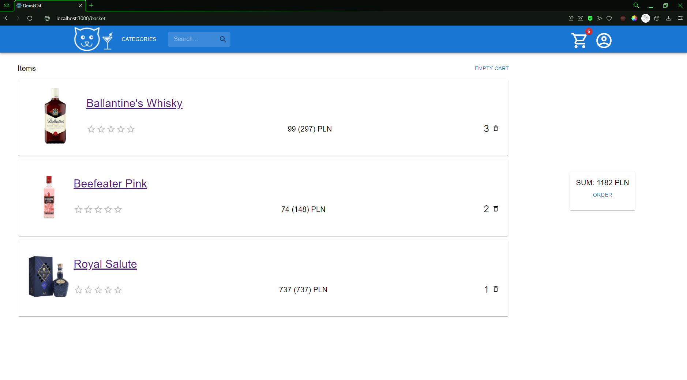
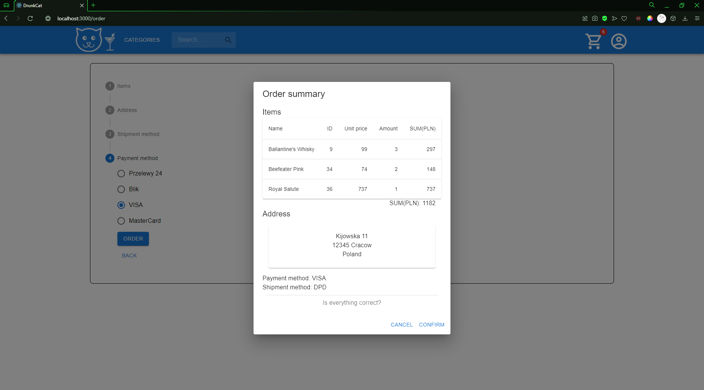
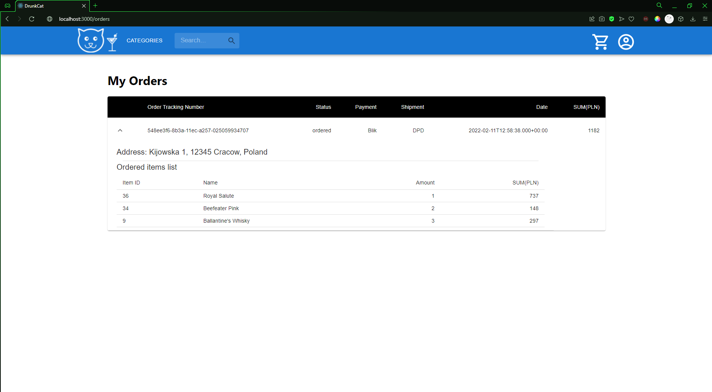

# E-commerce website

Project was created for Database University Course, which indicates the use of native SQL queries throughout the entire project. 

# Technologies and tools 

| Server side | Client side |
| :---: | :---: |
| IntelliJ IDEA | Visual Studio Code IDE |
| Java 8+ | React JS |
| Spring Boot 2.6+ | React Hooks |
| Spring Data JPA (Hibernate) | Redux |
| MySQL database | Axios HTTP library |
| Maven | Material UI |
| Postman client | Postman client |

## Main page

## Signup page

## Filtration output

## Product page

## Basket summary

## Order summary

## All orders details with products listed to each order

